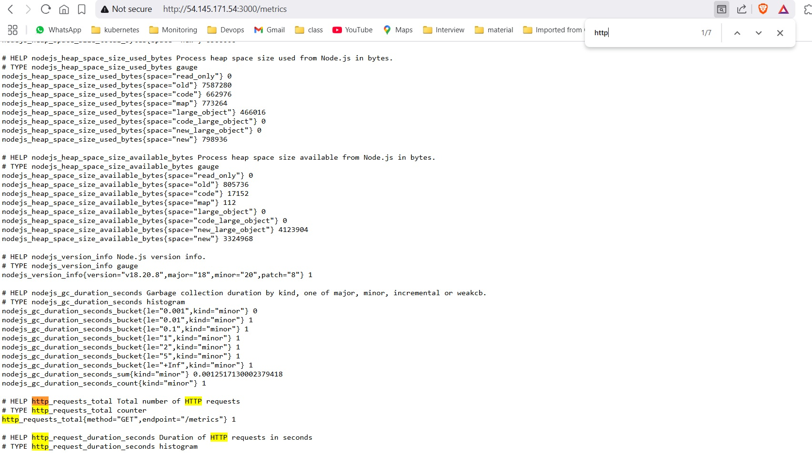
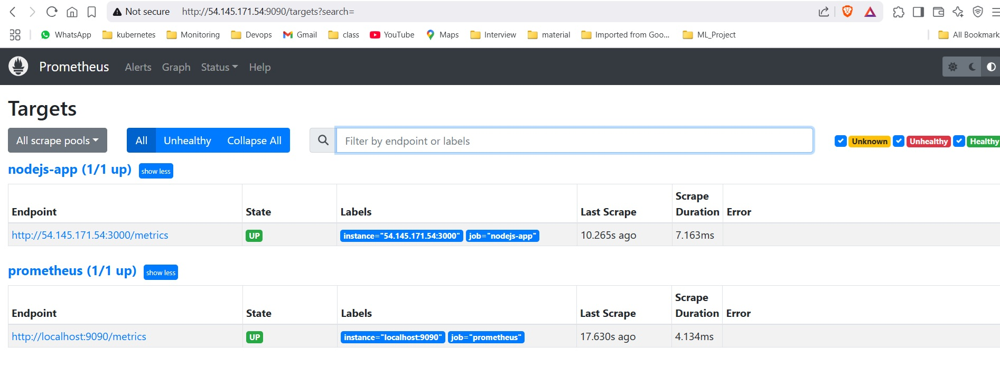
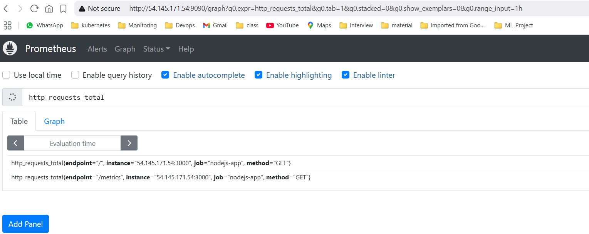

# Application monitoring with prometheous

## Install Prometheous

```bash
wget https://github.com/prometheus/prometheus/releases/download/v2.46.0/prometheus-2.46.0.linux-amd64.tar.gz
tar -xvzf prometheus-2.46.0.linux-amd64.tar.gz
cd prometheus-2.46.0.linux-amd64
./prometheus --config.file=prometheus.yml
```

## Build and Deploy Application

```bash
npm install
npm start
```

## Update ```prometheus.yml``` to include your Node.js application as a target

```bash
scrape_configs:
  - job_name: "nodejs-app"
    static_configs:
      - targets: ["54.145.171.54:3000"]

```

## Restart Prometheous

```bash
./prometheus --config.file=prometheus.yml
```

## Access Application

1. Checking application: http://54.145.171.54:3000/


2. Checking metrics api: http://54.145.171.54:3000/metrics



## Check prometheous for targets and metrics

1. Check targets status: http://54.145.171.54:9090/targets



2. Check metrics under prometheous: http://54.145.171.54:9090/


